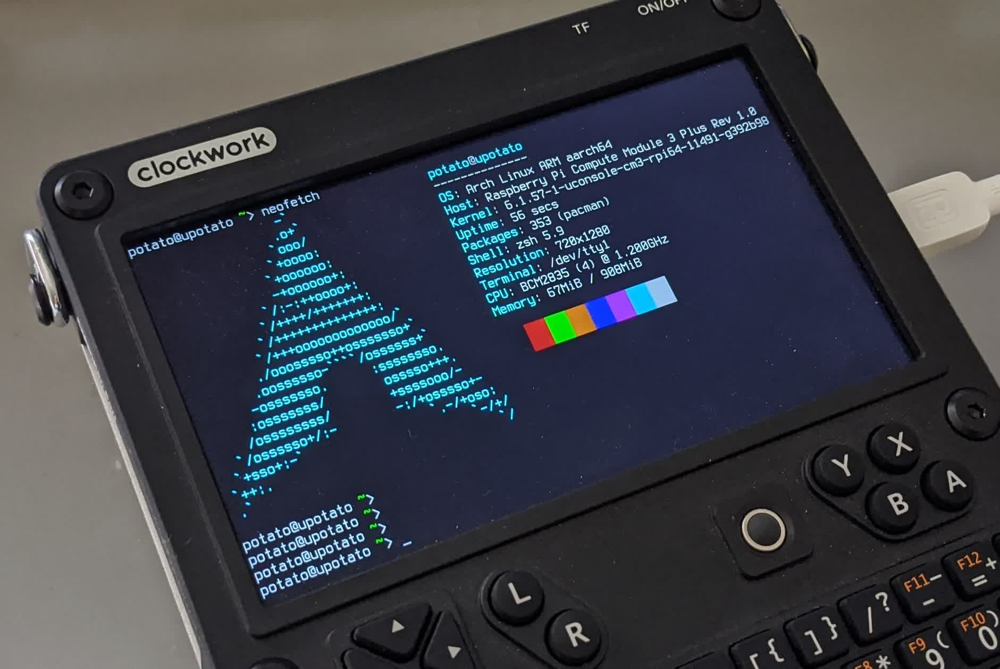

# uConsole CM3



Code and docs of uConsole with CM3 core.

Here I use ~~mainline linux~~ RPi's downstream fork.

I started from archlinuxarm's linux-aarch64. ~~It looks like RPi3's mainline support is enough mature.~~ I can reuse the infrastructure built by forks at archlinuxarm, focus on tweaking/optimizing linux.

## Current status

- [x] port drivers
- [x] write device tree
- [x] build test
- [x] test on real hardware
    - [x] kernel boots on a RPi 3B
    - [x] kernel boots on uConsole with CM3
    - [x] HDMI(video) works
    - [x] WiFi works
    - [x] Bluetooth works
    - [x] PMU works
        - the charging indicator/LED uses the same hack from CPi's patch, now LED will stay on when charging
    - [x] DSI panel works
        - There will be some error messages from kernel when screen is turned off, and it seems safe to ignore them.
    - [x] Audio works
        - [x] with 3.5mm jack detection
            - A better virtual sound card mode should be implemented to maintain different volume values for different outputs. But I don't know how. Help wanted.
- ~~[ ] trim build config~~
- [ ] setup CI/CD?

I've successfully adapted the uConsole patches to CM3. I've even written a new kernel driver to support automatic amplifier switch, so the speaker will automatically shutdown when 3.5mm jack is used. No software polling, efficient.

Raise issue if you have any problems.

It's reported that CM4's WiFi won't work if using the kernel package in this repo.

## How to install ArchLinux on uConsole/CM3 from scratch

Please read [the guide in doc(still draft)](doc/how-to-install-archlinux-from-scratch.md).

## QAs

### Do you plan to support more OSes?

They are essentially the same. Only the packaging methods differ. You can build your own kernel with patches and config in `PKGBUILDs/linux-uconsole-cm3-rpi64`.

### Why not create a full disk image?

kinda lazy ;)

Use [the scripts](https://github.com/PotatoMania/uconsole-cm3-arch-image-builder) to create customized system image, a rebuild of the kernel package might be necessary though.

_And I need time/investment for other personal projects._

## Notes

### WiFi & BT

Because of the operation voltage(3.3V by default) and RPi's limit, the WiFi part of the wireless module cannot run at its highest speed. But it should be enough.

BT serial speed will affect module's wireless performance. Just a note.

For Arch users: there's a [firmware package](https://gitlab.manjaro.org/manjaro-arm/packages/community/ap6256-firmware) to enable WiFi and BT hardware, packaged by Manjaro devs. It replaces the firmware packages derived from Armbian's and RPi's repositories, `brcmfmac43456-firmware` in aur and `firmware-raspberrypi` in alarm, respectively.

BT & WiFi coexistence may need further tweaking. When there's traffic over 2.4G WiFi, BT audio will stutter. Read [this post](https://community.infineon.com/t5/AIROC-Wi-Fi-and-Wi-Fi-Bluetooth/Bluetooth-audio-streaming-WiFi-inteference/td-p/379269) for available parameters. I failed to make BT audio stable with 2.4G WiFi. One workaround is soft-blocking WiFi using rfkill, or use 5G WiFi only.
Contributions welcomed.

### 4G/LTE modem

On uConsole with CM3, the official LTE modem will __ALWAYS__ be powered up on boot because the initial pulls of the pins.

### PMU/Power control

~~When plugged in, the system might not able to fully shutdown itself.~~ This is no longer a problem. This originates from I2C0's issue on RPi3 series. Somehow the communication will fail if hardware I2C0 is used.

The power button is the system power button, that means you can shutdown your uConsole just by clicking the power button.

Since Sun Nov  5 UTC 2023, this repo contains patches to enable gauge calibration on AXP228. To use it:

```bash
# initialize calibration
echo 1 | sudo tee /sys/class/power_supply/axp20x-battery/calibrate

# check status
cat /sys/class/power_supply/axp20x-battery/calibrate
# BIT(5): feature status, 1 for enabled
# BIT(4): active state, 1 for active, should be 0 after calibration done

# read current capacity(uWh)
# This is calculated from original uAh value from PMU reads.
# It assumes the typical voltage is 3.6V.
cat /sys/class/power_supply/axp20x-battery/energy_full
```

It's possible to manipulate the PMU directly with `i2c-tools`. In this case, the driver `i2c_dev` should be loaded with modprobe/insmod.

### DSI panel

Sometimes the screen will stay black. This is because a data transfer timeout and the LCD is not initialized. It occurs with about 10% chance when screen(and DSI bus) is fully reseted and can be fixed by doing another reset. There seems a bug for the driver `vc4_dsi`, see issue 4323 in raspberrypi/linux. Currently a few workarounds are required to fully eliminate this issue.

For ArchLinux users, you can try `rpi-dsi-workaround` in PKGBUILDs. Install the package and enable the service `rpi-dsi-workaround.service` to start it at boot. The workaround checks the DSI bus's state every 60 seconds, and reset the screen if an error is found. This feature requires latest patch set from `linux-uconsole-cm3-rpi64`.
