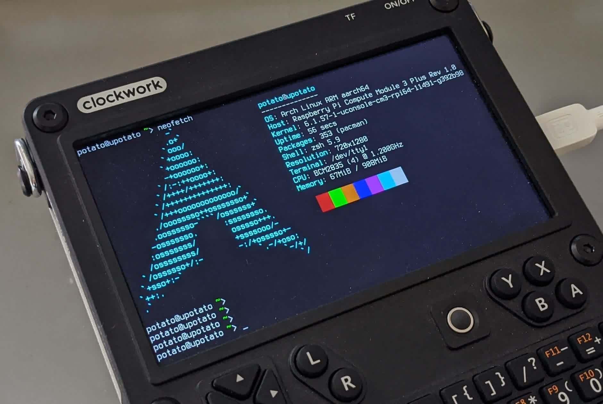

# uConsole CM3



Code and docs(guide, draft) for running Arch on uConsole with CM3/CM4S/CM4 w/ adapter.

Here I use ~~mainline linux~~ RPi's downstream fork.

Table of contents:

<!-- TOC depthfrom:2 -->

- [Repository structure](#repository-structure)
- [Current status](#current-status)
- [Install ArchLinux on uConsole/CM3 from scratch](#install-archlinux-on-uconsolecm3-from-scratch)
- [QAs](#qas)
    - [How it works?](#how-it-works)
    - [How to cross compile the kernel package?](#how-to-cross-compile-the-kernel-package)
    - [Do you plan to support more OSes?](#do-you-plan-to-support-more-oses)
    - [Why not create a full disk image?](#why-not-create-a-full-disk-image)
- [Notes](#notes)
    - [WiFi & BT](#wifi--bt)
    - [LTE/4G modem](#lte4g-modem)
    - [PMU/Power control](#pmupower-control)
    - [DSI panel](#dsi-panel)

<!-- /TOC -->

## Repository structure

- `PKGBUILDs`: Pacman packages for running ArchLinux on uConsole with CM3/CM4(S) core
    - including a linux package with essential driver patches
- `datasheets`: datasheets gathered from the internet serving as references
- `doc`: misc tutorials drafts

## Current status

- [x] port drivers
- [x] write device tree
- [x] build test
- [x] test on real hardware
    - [x] kernel boots on a RPi 3B
    - [x] kernel boots on uConsole with CM3
    - [x] HDMI(video) works
    - [x] WiFi works
    - [x] Bluetooth works
    - [x] PMU works
        - the charging indicator/LED uses the same hack from CPi's patch, now LED will stay on when charging
        - CM3's I2C0 is buggy and cannot be used for PMU, use i2c-gpio instead
    - [x] DSI panel works
        - There will be some error messages from kernel when screen is turned off, and it seems safe to ignore them.
        - with `6.6.51+g0fb3c83a9fa3`, the DSI panel can be turned off properly with MIPI commands.
    - [x] Audio works
        - [x] with 3.5mm jack detection
            - A better virtual sound card mode should be implemented to maintain different volume values for different outputs. But I don't know how. Help wanted.
- [?] CM4 support
    - it's done(finished)
    - (I) have no CM4 so (I) cannot test
    - a forum user reports that everything works with latest code
- [x] CM4S support
    - tested on a CM4S (CM4S01016B) board, everything works
    - It's fully compatible with CM3 from a hardware perspective. The software needs a few tweaks.
- ~~[ ] trim build config~~
- [ ] setup CI/CD?

I've successfully adapted the uConsole patches to CM3. I've even written a new kernel driver to support automatic amplifier switch, so the speaker will automatically shutdown when 3.5mm jack is used. No software polling, efficient.

Raise issue if you run into any problem.

For CM4 users, check your WiFi status. It's once reported that CM4's WiFi won't work if using the kernel package in this repo, though it should be fixed in latest code.

## Install ArchLinux on uConsole(CM3, CM4/S) from scratch

Please read [the guide in doc](doc/how-to-install-archlinux-from-scratch.md)(still draft and possibly will never be updated).

Or read [the scripts](https://github.com/PotatoMania/uconsole-cm3-arch-image-builder) to figure out the procedure.

## QAs

### How it works?

There exists working bootloader and kernel for RPi. The missing part is the drivers for uConsole. I fixed it through porting CPi's code to latest kernel, and then packaged it for ease of use. That's all, despite that there was some frustrating things during the process.

The original patch from clockworkpi is a disgusting mixture of several features/drivers.
I managed to break the useful parts into different patches, for easier porting & picking.
*Yet the new unified device tree overlay written by me is also disgusting.*

### How to cross compile the kernel package?

For arch, a standard way to build a kernel package is calling `makepkg` directly in the folder where `PKGBUILD` sits.
To cross compile it, just pass more environment variables, using this command:

```
makepkg CARCH=aarch64 ARCH=arm64 CROSS_COMPILE=aarch64-linux-gnu-
```

`CARCH=aarch64` is required to override the host arch detection mechanism in `makepkg`.

`ARCH=arm64 CROSS_COMPILE=aarch64-linux-gnu-` are the cross compile environment variables passed to the kbuild system(which builds the linux kernel).

When cross compiling, the kernel headers cannot be packaged properly, and just ignore any error about that.
Kernel headers must be built on the target machine to have the tools compiled for the target.

### Do you plan to support more OSes?

They are essentially the same. Only the packaging methods differ. You can build your own kernel with patches and config in `PKGBUILDs/linux-uconsole-rpi64`.

### Why not create a full disk image?

kinda lazy ;)

Use [the scripts](https://github.com/PotatoMania/uconsole-cm3-arch-image-builder) to create customized system image, a rebuild of the kernel package might be necessary though.

_And I need time/investment for other personal projects._

## Notes

### WiFi & BT

BT serial speed will affect module's wireless performance. Just a note.

For Arch users: there's a [firmware package](https://gitlab.manjaro.org/manjaro-arm/packages/community/ap6256-firmware) to enable WiFi and BT hardware, packaged by Manjaro devs. It replaces the firmware packages derived from Armbian's and RPi's repositories, `brcmfmac43456-firmware` in aur and `firmware-raspberrypi` in alarm, respectively.

BT & WiFi coexistence may need further tweaking. When there's traffic over 2.4G WiFi, BT audio will stutter. Read [this post](https://community.infineon.com/t5/AIROC-Wi-Fi-and-Wi-Fi-Bluetooth/Bluetooth-audio-streaming-WiFi-inteference/td-p/379269) for available parameters. I failed to make BT audio stable with 2.4G WiFi. One workaround is soft-blocking WiFi using rfkill, or use 5G WiFi only.
Contributions welcomed.

WiFi module on the carier board has a SDIO clock speed of 50MHz, which is limited by the operation voltage and RPi's limit. This is not the highest speed of the module, but it should be enough. The theoretical peak data rate is about `4bit/Hz * 50MHz = 200 Mbit`.

### LTE/4G modem

For uConsole with CM3/CM4S, the official LTE modem will __ALWAYS__ be powered up on system boot, because of the initial pulls of the pins.

### PMU/Power control

For CM3(RPi3 series), PMU must be controlled with `i2c-gpio` to avoid a hardware issue in I2C0, which causes disrupted communication, preventing the shutdown of PMU.

For all cores, the PMU power button is registered as the system power button, which means the uConsole can be shutted down just by clicking the power button.

Since Fri Sep 12 UTC 2025, this repo remove the patch for gauge calibration. To trigger gauge calibration, a hack is to use `i2c-tools` to manipulate the PMU. In this case, the driver `i2c_dev` should be loaded with modprobe/insmod.

### DSI panel

Sometimes the screen will stay black when turned on, yet the backlight is working. This is because a data transfer error in DSI block and the LCD is not initialized, which possibly because of an out-of-spec MIPI state.
It occurs with about 10% chance each reset of screen(and DSI bus), and can be temporarily fixed by doing another reset.

There seems a bug for the driver `vc4_dsi`, see issue 4323 in raspberrypi/linux. Currently a few workarounds are required to fully eliminate this issue.

On newer versions of RPi linux, [part of the DSI driver is fixed](https://github.com/raspberrypi/linux/commit/6da70162dd1e729c04e2dc25472b39390868af79) and the occuring chance of the issue is reduced to about 1%.

For ArchLinux users, you can try `rpi-dsi-workaround` in PKGBUILDs. Install the package and enable the service `rpi-dsi-workaround.service` to start it at boot. The workaround checks the DSI bus's state every 60 seconds, and reset the screen if an error is found. This feature requires the patch exposing DSI error state from the package `linux-uconsole-rpi64`.
